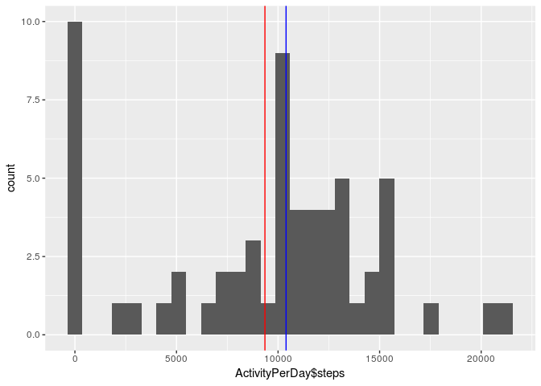

# Reproducible Research: Peer Assessment 1


## Loading and preprocessing the data


```r
library(dplyr)
```

```
## 
## Attaching package: 'dplyr'
```

```
## The following objects are masked from 'package:stats':
## 
##     filter, lag
```

```
## The following objects are masked from 'package:base':
## 
##     intersect, setdiff, setequal, union
```

```r
setwd("~/ReproducibleResearchHW1/RepData_PeerAssessment1/")
unzip("activity.zip")
ActivityData<-read.csv("activity.csv")
ActivityData$date<-ActivityData$date %>% as.Date()
```

## What is mean total number of steps taken per day?


```r
ActivityPerDay<-ActivityData %>% group_by(date)%>% summarise(steps=sum(steps,na.rm=T))
```
Let's calculate the mean and the median of the steps taken daily


```r
StepByDayData<-c(mean=mean(ActivityPerDay$steps,na.rm=T),
                median=median(ActivityPerDay$steps,na.rm=T))
print(StepByDayData)
```

```
##     mean   median 
##  9354.23 10395.00
```

The following makes a plot that shows the histogram of the distribution of the daily steps taken. The red bar shows the location of the mean, while the blue bar shows the location of the median.


```r
library(ggplot2)
qplot(ActivityPerDay$steps)+geom_vline(xintercept = StepByDayData,color=c("red","blue"))
```

```
## `stat_bin()` using `bins = 30`. Pick better value with `binwidth`.
```

<!-- -->


## What is the average daily activity pattern?

The following gropus the observations by interval ignoring missing values


```r
ActivityPerInterval<-ActivityData %>% group_by(interval)%>% summarise(meansteps=mean(steps,
                                                                                na.rm=T))
```
The following plot shows the mean steps taken in each interval


```r
ggplot(data = ActivityPerInterval,aes(x=interval,y=meansteps))+geom_line()
```

<!-- -->

The interval with the max number of steps is


```r
ActivityPerInterval[ActivityPerInterval$meansteps==max(ActivityPerInterval$meansteps),]
```

```
## # A tibble: 1 × 2
##   interval meansteps
##      <int>     <dbl>
## 1      835  206.1698
```


## Imputing missing values

The NA in the data will be imputated using the mean in a given interval.


```r
ActivityData2<-ActivityData
ActivityData2<-left_join(ActivityData,ActivityPerInterval)
```

```
## Joining, by = "interval"
```

```r
ActivityData2$steps[is.na(ActivityData2$steps)]<-ActivityData2$meansteps[is.na(ActivityData2$steps)]
ActivityData2$meansteps<-NULL
```
Using the same coda as above to show the histogram and calculate the mean and median.


```r
ActivityPerDay2<-ActivityData2 %>% group_by(date)%>% summarise(steps=sum(steps,na.rm=T))
```


```r
StepByDayData2<-c(mean=mean(ActivityPerDay2$steps,na.rm=T),
                median=median(ActivityPerDay2$steps,na.rm=T))
print(StepByDayData2)
```

```
##     mean   median 
## 10766.19 10766.19
```

The following makes a plot that shows the histogram of the distribution of the daily steps taken usint the imputed data. The red bar shows the location of the mean, while the blue bar shows the location of the median.


```r
library(ggplot2)
qplot(ActivityPerDay2$steps)+geom_vline(xintercept = StepByDayData2,color=c("red","blue"))
```

```
## `stat_bin()` using `bins = 30`. Pick better value with `binwidth`.
```

<!-- -->
Using this data we can see that imputing increases the mean slightly and makes it identical to the median in this particular case.
## Are there differences in activity patterns between weekdays and weekends?

Using the imputed data, we will add a dummy variable for the weekdays and weekend. Please note that due to location configuration of the computer I'm working on the names of the weekdays are in spanish in the output. So for reference

*    lunes=   Monday

*    martes =  Tuesday

*    miércoles =  Wednesday

*    jueves =    Thursday

*    viernes =     Friday

*    sábado =    Saturday

*    domingo =    Sunday


```r
weekend=c("sábado","domingo")
ActivityData2$weekend<-ifelse((ActivityData2$date%>% weekdays()) %in% weekend,
                              "weekend",
                              "weekday"
                              )
```

Next we will take the mean again grouping by weekend or weekday


```r
ActivityWeekend<-ActivityData2%>% group_by(weekend,interval) %>% summarise(steps=mean(steps))
```


Now we will compare the activity pattern using a panel plot


```r
ggplot(data = ActivityWeekend,aes(x=interval,y=steps))+geom_line()+facet_wrap(~weekend,
                                                                              ncol=1)
```

<!-- -->


